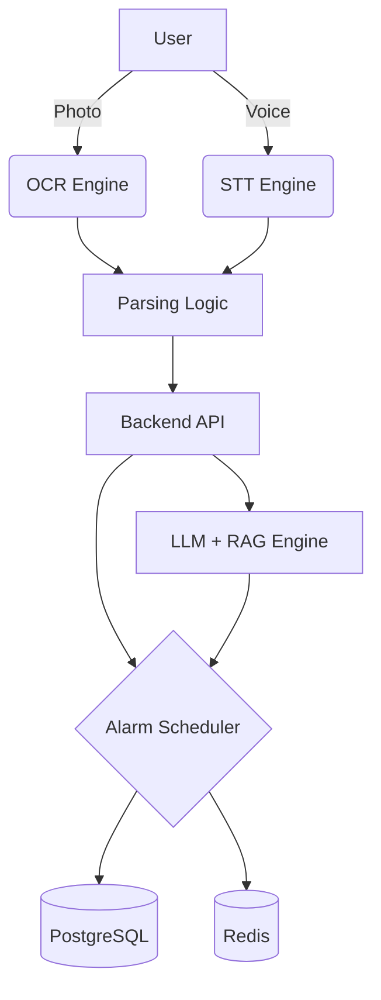

# 🌟 약꼬박
**찍거나 말하거나, 초간편 복약 알리미**

약꼬박은 약봉투 촬영(OCR) 또는 음성(STT) 입력만으로  
복약 시간·횟수·기간을 자동 추출해 알림을 등록하는 **완전 자동화 복약 관리 앱**입니다.  
특히 시니어·만성질환자·디지털 취약계층도 쉽게 사용할 수 있도록 설계되었습니다.

---

## 📱 UI Mockups

> 아래 이미지는 README 데모용이며, 실제 프로젝트에서는 /assets 폴더 이미지로 교체하세요.

  

---

## ✨ 주요 기능

### 📸 1) AI-OCR 기반 약봉투 인식
- 약봉지를 촬영하면 복약 정보 자동 추출  
  - 복약 기간 (예: 3일분)  
  - 아침/점심/저녁 복용 시간  
  - 복용 방식 (식후·식전)  
- 약봉투는 구조화된 문서라 **OCR 정확도가 매우 높음**

---

### 🎙️ 2) 음성(STT) 기반 복약 알람 등록
- “3일 동안 아침·저녁 식후 약 먹기” → 자동 알람 생성  
- 자연어 기반 일정 파싱  

---

### 💊 3) AI 영양제 관리 기능
- 영양제 주요 성분 기준으로 **권장 복용 시간 자동 분석**  
  - 예: 철분 → 공복 권장  
- 기존 복약 일정과 충돌하지 않는 최적의 시간으로 자동 설정  

---

### 🤖 4) 증상 기반 약/영양제 추천 챗봇
- “요즘 피곤해요” → 관련 영양제/약 추천  
- 공공데이터 기반 LLM + RAG 적용  

---

### 🧓 5) 시니어 친화적 UI
- 큰 글씨, 큰 버튼  
- 2–3단계면 누구나 등록 가능  
- 사용자가 ‘입력’을 하지 않아도 되는 **Zero-Input UX**

---

### 👨‍👩‍👧 6) 가족 안심 알림
- 일정 시간 복약 체크 없을 시 → 보호자에게 알림 전송  

---

## 🧭 서비스 흐름 (User Flow)

### 1. 초기 설정 (최초 1회)
- 어르신의 아침/점심/저녁 식사 시간만 설정  
- 이후 모든 알림은 자동 설정

### 2. 등록 방식
**A. 약봉투 촬영**  
**B. 음성으로 “아침 저녁 3일치 약 등록해줘”라고 말하기**

### 3. AI 자동 해석  
- OCR/STT → 복약 정보 파싱  
- 식사 시간 기반 식후/식전 시간 자동 계산  

### 4. 사용자 확인  
- “이렇게 맞나요?” 단일 확인 화면 제공  

### 5. 알림 제공  
- 약 복용 시간에 큰 글씨 알림  
- “먹음” 버튼으로 복약 체크  

---

## 🏗️ 시스템 아키텍처

---

# 🔧 기술 스택

### **프론트엔드**

* React or React Native
* TypeScript
* Zustand / Recoil
* Senior-friendly UI Layout Patterns

### **백엔드**

* FastAPI
* PostgreSQL
* Redis (알람 스케줄 관리)
* pgvector

### **AI / ML**

* OCR: Azure document intelligence
* STT: Azure STT
* LLM + RAG

  * 건강 기능식품 데이터(C003, I2710) 기반
  * 증상 기반 약/영양제 추천

### **인프라**

* Docker
* GitHub Actions (CI/CD)
* Azure

---

# 📝 License

**MIT License**

---

# 👥 팀 'Shooting Star'

* 95ChrisJHUm
* GG0hen1
* HwangSeungMin
* jjoyu1
* minstitia
